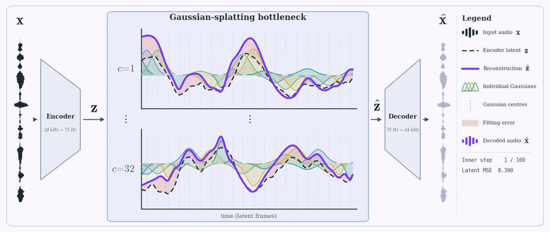
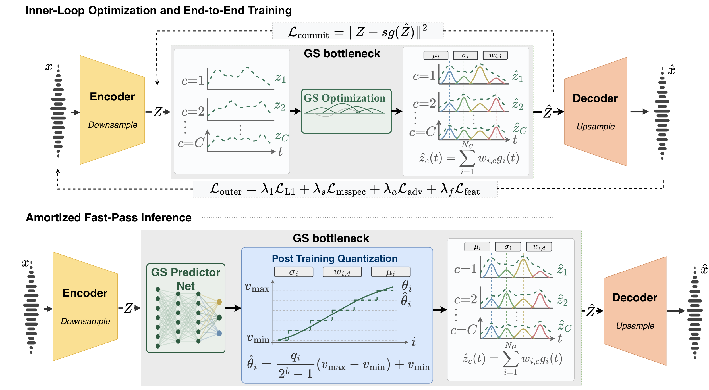

# GS-Codec: A Gaussian-Splatting Bottleneck for Neural Audio Coding

[](https://ronaluf.github.io/gs-codec/)
[](LICENSE)
[](pyproject.toml)

**Ron Aluf, Alon Canfi, Eliya Nachmani** · Ben-Gurion University of the Negev · NeurIPS 2026

<p align="center">
  
</p>

GS-Codec replaces the vector quantizer of a neural audio codec with a parametric decomposition.
Each 3-second segment of the encoder latent is represented as a weighted sum of 1D Gaussian
primitives, fitted by an inner optimization loop during training and regressed in a single forward
pass by the **GS Predictor** at inference. Scalar quantization is applied only after training, so a
single checkpoint covers a continuous range of bitrates by changing the number of primitives
$`N_G`$ and the bit depth $`B`$.

<p align="center">
  
</p>

**Training (top):** the encoder latent is approximated by $`N_G`$ Gaussian primitives via an inner
optimization loop. **Inference (bottom):** the GS Predictor regresses the primitive parameters in a
single pass; they are then quantized, transmitted, and decoded.

## Installation

```bash
pip install git+https://github.com/ronaluf/gs-codec
```

For training and evaluation, clone the repository and install the extras:

```bash
git clone https://github.com/ronaluf/gs-codec && cd gs-codec
pip install -e ".[train,eval]"
```

## Quickstart

```python
from gscodec import GSCodec
from gscodec.data.audio import audio_read, audio_write

codec = GSCodec.from_pretrained("ronaluf/gs-codec-24khz")
wav, sr = audio_read("speech.wav")

code = codec.encode(wav, sample_rate=sr, n_gaussians=102, n_bits=5)  # 5.95 kbps
open("speech.gsc", "wb").write(code.to_bytes())
audio_write("speech_decoded", codec.decode(code), codec.sample_rate)
```

From the command line:

```bash
gscodec encode speech.wav speech.gsc --n_gaussians 102 --n_bits 5
gscodec decode speech.gsc speech_decoded.wav
gscodec reconstruct speech.wav speech_decoded.wav --mode iterative
```

`encode` accepts:

| Argument | Values | Description |
|---|---|---|
| `mode` | `predictor` (default), `iterative` | GS Predictor (single pass) or inner Adam fitting (300 steps) |
| `n_gaussians` | any $`N_G`$ | primitives per 3 s segment |
| `n_bits` | $`B`$ | bits per scale and amplitude (k-means codebooks) |
| `freeze_positions` | `False` (default), `True` | centers predicted and sent with 10 bits, or fixed to a uniform grid |

## Bitrate

Per 3-second segment with $`C = 32`$ latent channels:

```math
\text{bits} = (C + 1)\, N_G\, B + N_G\, B_\mu
```

with $`B_\mu = 10`$ for free centers and $`B_\mu = 0`$ for grid centers.

```bash
gscodec bitrate --n_gaussians 102 --n_bits 5                     # 17850 bits / 3 s = 5.950 kbps
gscodec bitrate --n_gaussians 109 --n_bits 5 --freeze_positions  # 17985 bits / 3 s = 5.995 kbps
```

## Pretrained models

Pretrained checkpoints will be released soon.

## Training

Training uses [Dora](https://github.com/facebookresearch/dora) and Hydra. Build a manifest for each
split (see [`egs/README.md`](egs/README.md)), then train the codec with the iterative
Gaussian-splatting bottleneck:

```bash
dora -P gscodec run solver=compression/gaussian_24khz dset=audio/librilight
```

Train the GS Predictor on the frozen codec:

```bash
dora -P gscodec run solver=compression/gs_predictor_24khz dset=audio/librilight \
  gaussian_splat.amortized_pretrained_codec_path=outputs/xps/<codec_sig>/checkpoint.th
```

Experiments are written to `outputs/` (set `GSCODEC_DORA_DIR` to change it). Any config value can
be overridden on the command line, e.g. `gaussian_splat.n_gaussians=100 dataset.batch_size=8`.
Export a checkpoint to a model directory:

```bash
python scripts/export_checkpoint.py outputs/xps/<sig>/checkpoint.th pretrained/gs-codec-24khz
```

## Evaluation

```bash
# 1. Codebooks on a held-out set
python scripts/calibrate_codebooks.py pretrained/gs-codec-24khz --files LibriTTS/dev-clean \
  --mode predictor --n_gaussians 102 --n_bits 5

# 2. Encode to bitstreams, decode from disk
python scripts/reconstruct.py pretrained/gs-codec-24khz --files LibriSpeech/test-clean \
  --out_dir runs/pred_102_b5 --n_gaussians 102 --n_bits 5 --min_duration 4 --max_duration 10

# 3. PESQ, STOI, UTMOS, WER (and SIM with --sim_checkpoint)
python scripts/evaluate.py runs/pred_102_b5 --transcripts LibriSpeech/test-clean
```

## Repository layout

```
gscodec/
  codec.py                 GSCodec API and bitstream format
  ptq.py                   k-means codebooks, bit packing, bit accounting
  quantization/
    gaussian_splat.py      Gaussian-splatting bottleneck (inner Adam fit, STE, commitment loss)
    amortized_predictor.py GS Predictor
  models/  modules/        SEANet encoder/decoder with Snake activations
  solvers/ losses/ adversarial/ data/ optim/   training
config/                    Hydra configs (codec, predictor, datasets)
scripts/                   export, calibration, reconstruction, evaluation
tests/
```

## License

Code is released under the [MIT License](LICENSE). Parts adapted from
[AudioCraft](https://github.com/facebookresearch/audiocraft) and
[DAC](https://github.com/descriptinc/descript-audio-codec) keep their original MIT notices in
[`LICENSE.audiocraft`](LICENSE.audiocraft), [`LICENSE.dac`](LICENSE.dac) and file headers.

## Acknowledgements

The training framework and SEANet autoencoder build on [AudioCraft](https://github.com/facebookresearch/audiocraft)
and [EnCodec](https://github.com/facebookresearch/encodec). The Snake activation follows
[DAC](https://github.com/descriptinc/descript-audio-codec), and UTMOS uses
[SpeechMOS](https://github.com/tarepan/SpeechMOS).

## Citation

```bibtex
@inproceedings{aluf2026gscodec,
  title     = {{GS-Codec}: A Gaussian-Splatting Bottleneck for Neural Audio Coding},
  author    = {Aluf, Ron and Canfi, Alon and Nachmani, Eliya},
  booktitle = {Advances in Neural Information Processing Systems},
  year      = {2026}
}
```
